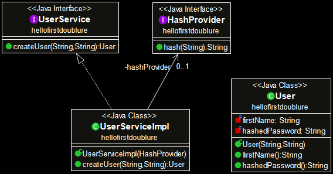

# Ecrivez votre première doublure …

Créez un projet Maven que vous appellerez **`firstdoublure`** et **ajoutez une dépendance vers [Mockito](https://site.mockito.org/)** au **`pom.xml`** de ce projet. 

Imaginez que vous êtes en train de travailler sur une application dans laquelle on souhaite maintenant créer des utilisateurs dont le mot de passe est correctement haché.

Vous n’êtes pas un spécialiste de la cryptographie et vous décidez donc de déléguer la partie sur le hachage à un de vos collègues qui sera chargé de développer un composant capable de vous fournir un mot de passe correctement haché à partir d’un texte passé en paramètre.

Vous vous mettez d’accord sur l’interface de ce composant :  

```java
    public interface HashProvider {
        String hash(String text);
    }
```

Pour vous, ce composant n’est donc pas disponible pour le moment, seule son l’interface est connue.  
Vous devez donc **commencer par ajouter l’interface** **`HashProvider`** dans le code source de votre projet (**`src/main/java`**)

Votre travail consiste ensuite à développer un service qui va permettre de créer un utilisateur.  
Vous allez donc déclarer, à votre tour, une interface **`UserService`** qui propose le service que vous êtes en train de développer.    
Dans **`src/main/java`**, ajoutez donc maintenant l’interface **`UserService`** suivante :

```java
    public interface UserService {
        User createUser(String firstname, String password);
    }
```

Pour que ce code puisse compiler, il faut disposer de la classe **`User`** que vous vous empressez d’implémenter le plus simplement possible.
Dans **`src/main/java`**, vous ajoutez donc la classe **`User`** suivante :

```java
    public class User {

        private final String firstName;
        private final String hashedPassword;

        public User(String firstName, String hashedPassword) {
            this.firstName = firstName;
            this.hashedPassword = hashedPassword;
        }

        public String firstName() {
            return firstName;
        }

        public String hashedPassword() {
            return hashedPassword;
        }
    }
```

**Vérifiez que votre code compile bien !** … avant de continuer.  

Il ne vous reste plus qu’à implémenter le service **`createUser`** qui vous a été demandé.  
… Et vous l’implémentez le plus simplement possible dans la classe **`UserServiceImpl`** en faisant appel au **`HashProvider`** que votre collègue est en train d’écrire de son côté …

```java
    public class UserServiceImpl implements UserService {

        private final HashProvider hashProvider;

        public UserServiceImpl(HashProvider hashProvider) {
            this.hashProvider = hashProvider;
        }

        @Override
        public User createUser(String firstName, String password) {
            String hashedPassword = hashProvider.hash(password);
            return new User(firstName, hashedPassword);
        }
    } 
```

Ajoutez la classe **`UserServiceImpl`** dans votre **`src/main/java`** !

Vérifiez que votre code compile ! Pour mieux comprendre la conception que vous venez d'implémenter, **à l'aide de votre IDE (et ObjectAid sous Eclipse), procédez à un petit reverse sur le code métier (`src/main/java`) pour visualiser le diagramme de classes correspondant :**  

 

Votre implémentation terminée, il ne vous reste plus qu’à la tester !

Dans **`src/test/java`**, créez une classe **`UserServiceImplTest`** et commencez à l’implémenter comme suit avec les **`import`** qui permettent de faire compiler le code en ne laissant qu'une erreur sur l'instruction à compléter (celle avec `new UserServiceImpl(???)`)

```java
    public class UserServiceImplTest {

        @Test
        void should_create_user_with_hashed_password() {

                UserService userService = new UserServiceImpl(???);

                User user = userService.createUser("Bob", "secret");

                 assertEquals(user.firstName(), "Bob"); 
                 assertEquals(user.hashedPassword(), "???"); 
        }
    }
```

Cette classe doit vous permettre au travers de la méthode **`should_create_user_with_hashed_password`** de tester que votre service fonctionne correctement c-a-d que l’utilisateur est bien créé avec un mot de passe correctement haché (différent de celui saisi).

Mais que mettre dans les **`???`** puisque le composant qui est censé fournir le mot de passe crypté n’est pas encore disponible puisque votre collègue est justement en train de le développer …  
La solution à ce problème consiste bien sûr à utiliser une doublure de **`HashProvider`** pour simuler le comportement attendu.

**A vous de jouer !!!**  
**Complétez ce test avec une doublure de type `mock` et faites le passer au VERT !!!**

Vous utiliserez les tests unitaires TestNG (JUnit 5 est également accepté).
